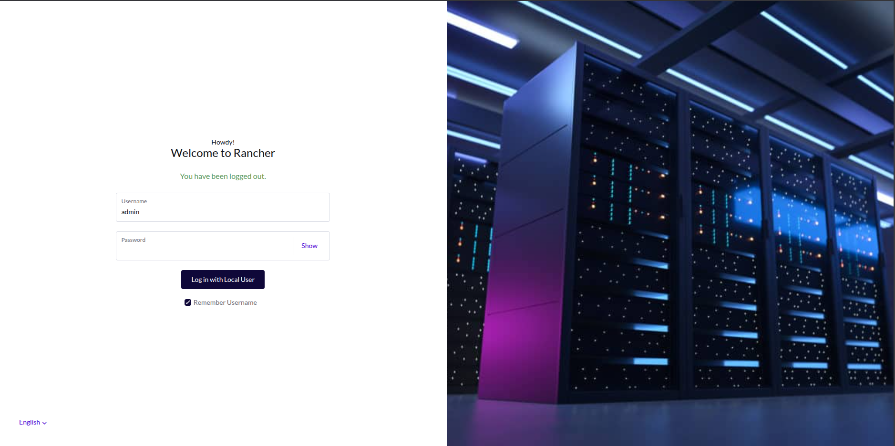
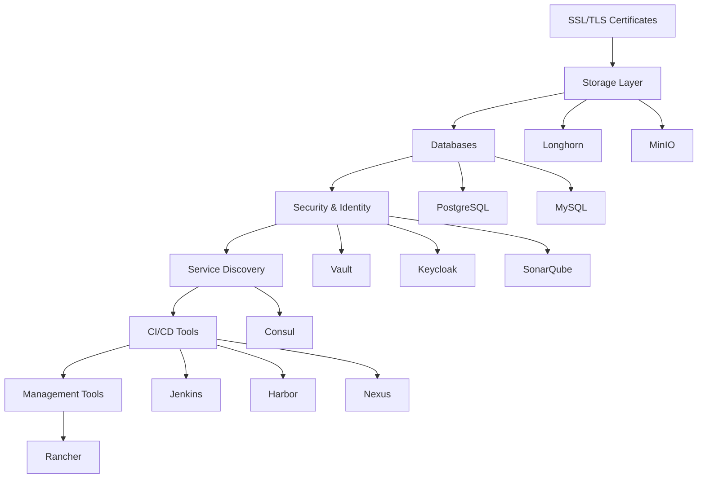
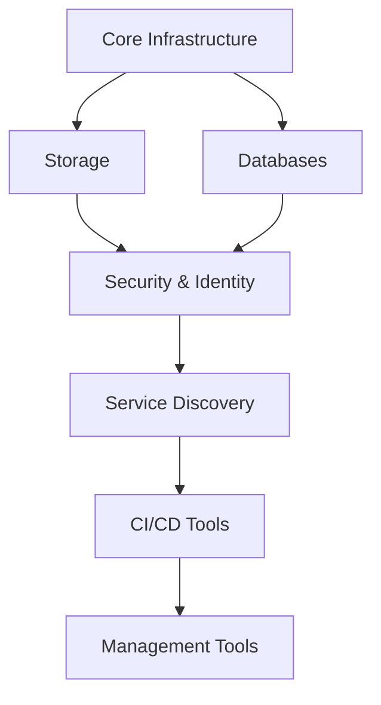

# DevSecOps Platform on Kubernetes

[](https://opensource.org/licenses/MIT)
[](https://kubernetes.io/)
[](https://helm.sh/)

> **Enterprise-grade DevSecOps platform designed to accelerate software delivery while maintaining the highest security standards**

## 🎯 Overview

This comprehensive DevSecOps platform provides development teams with a production-ready Kubernetes environment that integrates security at every stage of the software development lifecycle. Our platform enables developers to deliver high-quality software solutions faster through automated CI/CD pipelines, continuous security scanning, and robust infrastructure management.


---

## 📁 Folder Structure

The platform is organized with a flat directory structure for easy access and maintenance:

```
kubernetes/
├── auth/              # 🔐 Kubernetes authentication & RBAC
├── consul/            # 🎯 Service discovery & configuration
├── harbor/            # 🐳 Container registry with security scanning  
├── jenkins/           # 🔄 CI/CD automation server
├── keycloak/          # 👤 Identity & access management
├── longhorn/          # 💾 Distributed block storage
├── minio/             # 📦 S3-compatible object storage
├── mysql/             # 🗄️ MySQL database
├── nexus/             # 📚 Universal artifact repository
├── postgresql/        # 🐘 PostgreSQL database
├── ransher/           # 🖥️ Kubernetes cluster management (Rancher)
├── sonarqube/         # 🛡️ Code quality & security analysis
├── ssl/               # 🔒 SSL/TLS certificate management
└── vault/             # 🔑 Secrets management
```

---

## 🏗️ Platform Services

### 🔄 CI/CD & Build Tools

| Service | Purpose | Access URL | Key Features |
|---------|---------|------------|--------------|
| **Jenkins** | CI/CD Automation | `jenkins.marouanedbibih.studio` | • Dynamic K8s agents<br>• Pipeline as Code<br>• Multi-branch builds<br>• Automated testing |
| **Harbor** | Container Registry | `harbor.marouanedbibih.studio` | • Vulnerability scanning<br>• Image signing<br>• RBAC<br>• Replication |
| **Nexus** | Artifact Repository | - | • Maven/npm/Docker repos<br>• Proxy repositories<br>• Security scanning |

### 🔒 Security & Identity

| Service | Purpose | Access URL | Key Features |
|---------|---------|------------|--------------|
| **SonarQube** | Code Quality & Security | `sonarqube.marouanedbibih.studio` | • Static code analysis<br>• Security hotspot detection<br>• Quality gates<br>• Technical debt tracking |
| **Vault** | Secrets Management | - | • Dynamic secrets<br>• Encryption as a service<br>• Identity-based access<br>• Audit logging |
| **Keycloak** | Identity & Access Management | - | • Single Sign-On (SSO)<br>• Multi-factor authentication<br>• Role-based access control<br>• Federation |
| **Auth** | Kubernetes RBAC | - | • Service accounts<br>• Cluster roles<br>• Role bindings<br>• Authentication tokens |

### 🎯 Service Discovery & Storage

| Service | Purpose | Access URL | Key Features |
|---------|---------|------------|--------------|
| **Consul** | Service Discovery | `consul.marouanedbibih.studio` | • Service mesh<br>• Health checking<br>• KV store<br>• DNS integration |
| **MinIO** | Object Storage | `minio.marouanedbibih.studio` | • S3-compatible API<br>• High availability<br>• Encryption<br>• Multi-tenancy |
| **Longhorn** | Block Storage | `longhorn.marouanedbibih.studio` | • Distributed storage<br>• Backup/restore<br>• Volume snapshots<br>• Cross-zone replication |

### 🗄️ Databases & Management

| Service | Purpose | Access URL | Key Features |
|---------|---------|------------|--------------|
| **PostgreSQL** | Primary Database | - | • ACID compliance<br>• Advanced SQL features<br>• High availability<br>• Backup & recovery |
| **MySQL** | Secondary Database | - | • Legacy app support<br>• Specific workloads<br>• Replication<br>• Clustering |
| **Rancher** | Kubernetes Management | `rancher.marouanedbibih.engineer` | • Multi-cluster management<br>• Application catalog<br>• Monitoring dashboards<br>• RBAC |

---

## 🏛️ Architecture

### High-Level Architecture

```
┌─────────────────────────────────────────────────────────────────┐
│                    DevSecOps Platform                          │
├─────────────────────────────────────────────────────────────────┤
│  🌐 Ingress Layer (NGINX + SSL/TLS)                           │
├─────────────────────────────────────────────────────────────────┤
│  CI/CD Pipeline          │  Security Layer     │  Monitoring    │
│  ┌─────────────────┐    │  ┌─────────────┐    │  ┌──────────┐  │
│  │ Jenkins         │    │  │ SonarQube   │    │  │ Rancher  │  │
│  │ Harbor Registry │    │  │ Vault       │    │  │ Longhorn │  │
│  │ Nexus Artifacts │    │  │ Keycloak    │    │  └──────────┘  │
│  └─────────────────┘    │  └─────────────┘    │                │
├─────────────────────────────────────────────────────────────────┤
│  Service Discovery & Configuration Management                   │
│  ┌─────────────────┐    ┌─────────────────┐                   │
│  │ Consul          │    │ MinIO Storage   │                   │
│  └─────────────────┘    └─────────────────┘                   │
├─────────────────────────────────────────────────────────────────┤
│  Data Layer                                                     │
│  ┌─────────────────┐    ┌─────────────────┐                   │
│  │ PostgreSQL      │    │ MySQL           │                   │
│  └─────────────────┘    └─────────────────┘                   │
├─────────────────────────────────────────────────────────────────┤
│                    Kubernetes Cluster                          │
└─────────────────────────────────────────────────────────────────┘
```

### Component Dependencies



---

## 🚀 Installation & Deployment

### Prerequisites

- **Kubernetes cluster** (v1.24+)
- **Helm 3.x** installed
- **kubectl** configured
- **Domain names** configured (*.marouanedbibih.studio)
- **Ingress Controller** (NGINX recommended)
- **cert-manager** for SSL certificates

### Deployment Order

Deploy components in the following order to respect dependencies:

#### 1. Core Infrastructure

```bash
# Install NGINX Ingress Controller
kubectl apply -f https://raw.githubusercontent.com/kubernetes/ingress-nginx/controller-v1.8.1/deploy/static/provider/cloud/deploy.yaml

# Install cert-manager
kubectl apply -f https://github.com/cert-manager/cert-manager/releases/download/v1.13.0/cert-manager.yaml

# Deploy SSL certificates
kubectl apply -f kubernetes/ssl/
```

#### 2. Storage Layer

```bash
# Deploy Longhorn distributed storage
kubectl create namespace longhorn-system
helm repo add longhorn https://charts.longhorn.io
helm install longhorn longhorn/longhorn --namespace longhorn-system --values kubernetes/longhorn/values.yaml

# Deploy MinIO object storage
kubectl create namespace minio
helm repo add minio https://helm.min.io/
helm install minio minio/minio --namespace minio --values kubernetes/minio/values.yaml
```

#### 3. Database Services

```bash
# Deploy PostgreSQL
kubectl create namespace postgresql
helm repo add bitnami https://charts.bitnami.com/bitnami
helm install postgresql bitnami/postgresql --namespace postgresql --values kubernetes/postgresql/values.yaml

# Deploy MySQL
kubectl create namespace mysql
helm install mysql bitnami/mysql --namespace mysql --values kubernetes/mysql/values.yaml
```

#### 4. Security & Identity

```bash
# Deploy RBAC configurations
kubectl apply -f kubernetes/auth/

# Deploy Vault
kubectl create namespace vault
helm repo add hashicorp https://helm.releases.hashicorp.com
helm install vault hashicorp/vault --namespace vault --values kubernetes/vault/values.yaml

# Deploy Keycloak
kubectl create namespace keycloak
helm install keycloak bitnami/keycloak --namespace keycloak --values kubernetes/keycloak/values.yaml

# Deploy SonarQube
kubectl create namespace sonar
helm repo add sonarqube https://SonarSource.github.io/helm-chart-sonarqube
helm install sonarqube sonarqube/sonarqube --namespace sonar --values kubernetes/sonarqube/values.yaml
```

#### 5. Service Discovery

```bash
# Deploy Consul
kubectl create namespace consul
helm repo add bitnami https://charts.bitnami.com/bitnami
helm install consul bitnami/consul --namespace consul --values kubernetes/consul/values.yaml
```

#### 6. CI/CD Pipeline

```bash
# Deploy Nexus
kubectl create namespace nexus
helm install nexus bitnami/nexus --namespace nexus --values kubernetes/nexus/values.yaml

# Deploy Harbor
kubectl create namespace harbor
helm repo add harbor https://helm.goharbor.io
helm install harbor harbor/harbor --namespace harbor --values kubernetes/harbor/values.yaml

# Deploy Jenkins
kubectl create namespace jenkins
helm repo add jenkins https://charts.jenkins.io
helm install jenkins jenkins/jenkins --namespace jenkins --values kubernetes/jenkins/values.yaml
```

#### 7. Management Tools

```bash
# Deploy Rancher
kubectl create namespace cattle-system
helm repo add rancher-stable https://releases.rancher.com/server-charts/stable
helm install rancher rancher-stable/rancher --namespace cattle-system --values kubernetes/ransher/values.yaml
```

### Quick Deployment Script

```bash
#!/bin/bash
# Deploy entire DevSecOps platform
set -e

echo "🚀 Deploying DevSecOps Platform..."

# Core Infrastructure
echo "📋 Step 1: Core Infrastructure"
kubectl apply -f kubernetes/ssl/

# Storage
echo "📋 Step 2: Storage Layer"
./scripts/deploy-storage.sh

# Databases
echo "📋 Step 3: Database Services"
./scripts/deploy-databases.sh

# Security
echo "📋 Step 4: Security & Identity"
./scripts/deploy-security.sh

# Service Discovery
echo "📋 Step 5: Service Discovery"
./scripts/deploy-consul.sh

# CI/CD
echo "📋 Step 6: CI/CD Pipeline"
./scripts/deploy-cicd.sh

# Management
echo "📋 Step 7: Management Tools"
./scripts/deploy-management.sh

echo "✅ DevSecOps Platform deployment completed!"
```

---

## 🔧 Configuration

### Environment Variables

Create a `.env` file with your environment-specific values:

```bash
# Domain Configuration
DOMAIN_BASE=marouanedbibih.studio
RANCHER_DOMAIN=marouanedbibih.engineer

# Storage Configuration
LONGHORN_STORAGE_CLASS=longhorn
MINIO_ACCESS_KEY=admin
MINIO_SECRET_KEY=password123

# Database Configuration
POSTGRES_DB=devops
POSTGRES_USER=admin
POSTGRES_PASSWORD=secure_password

# Security Configuration
VAULT_SEAL_TYPE=shamir
KEYCLOAK_ADMIN_USER=admin
KEYCLOAK_ADMIN_PASSWORD=admin123
```

### Customization

Each component can be customized by modifying its `values.yaml` file:

```bash
# Customize Jenkins
vi kubernetes/jenkins/values.yaml

# Customize Harbor
vi kubernetes/harbor/values.yaml

# Apply changes
helm upgrade jenkins jenkins/jenkins --namespace jenkins --values kubernetes/jenkins/values.yaml
```

---

## 🧪 Testing & Validation

### Platform Health Check

Use the comprehensive test script to validate platform health:

```bash
# Run all tests
./scripts/test.sh

# Run specific component tests
./scripts/test.sh -n jenkins

# Quick health check
./scripts/test.sh -q

# Verbose output
./scripts/test.sh -v
```

### Manual Validation

```bash
# Check all pods
kubectl get pods --all-namespaces

# Check services
kubectl get services --all-namespaces

# Check ingress
kubectl get ingress --all-namespaces

# Check storage
kubectl get pv,pvc --all-namespaces
```

---

## 📚 Documentation

### Component Documentation

- [Jenkins CI/CD Setup](./docs/jenkins/architecture.md)
- [Harbor Registry Configuration](./kubernetes/harbor/README.md)
- [SonarQube Quality Gates](./kubernetes/sonarqube/README.md)
- [Vault Secrets Management](./kubernetes/vault/README.md)
- [Consul Service Discovery](./kubernetes/consul/README.md)
- [Longhorn Storage](./kubernetes/longhorn/README.md)
- [Rancher Management](./kubernetes/ransher/README.md)

### Infrastructure Guides

- [Kubernetes Setup](./docs/k8s/setup.md)
- [Ingress Configuration](./docs/k8s/ingress.md)
- [Helm Usage Guide](./docs/k8s/helm.md)
- [SSL/TLS Management](./kubernetes/ssl/README.md)

### Security Documentation

- [RBAC Configuration](./kubernetes/auth/README.md)
- [Security Best Practices](./docs/security/best-practices.md)
- [Compliance Guidelines](./docs/security/compliance.md)

---

## 🤝 Contributing

We welcome contributions! Please follow these guidelines:

### Development Workflow

1. **Fork** the repository
2. **Create** a feature branch (`git checkout -b feature/new-feature`)
3. **Make** your changes
4. **Test** your changes (`./scripts/test.sh`)
5. **Commit** your changes (`git commit -am 'Add new feature'`)
6. **Push** to the branch (`git push origin feature/new-feature`)
7. **Create** a Pull Request

### Code Standards

- Follow Kubernetes best practices
- Use meaningful commit messages
- Add documentation for new features
- Ensure all tests pass

---

## 🆘 Support

### Getting Help

- **Documentation**: Check the relevant component documentation
- **Issues**: [GitHub Issues](https://github.com/marouanedbibih/infra/issues)
- **Discussions**: [GitHub Discussions](https://github.com/marouanedbibih/infra/discussions)

### Troubleshooting

Common issues and solutions:

```bash
# Pod not starting
kubectl describe pod <pod-name> -n <namespace>
kubectl logs <pod-name> -n <namespace>

# Service not accessible
kubectl get endpoints <service-name> -n <namespace>
kubectl get ingress -n <namespace>

# Storage issues
kubectl get pv,pvc --all-namespaces
kubectl describe pvc <pvc-name> -n <namespace>
```

---

## 📄 License

This project is licensed under the MIT License - see the [LICENSE](LICENSE) file for details.

---

## 🙏 Acknowledgments

- **Kubernetes Community** for the amazing platform
- **Helm Community** for package management
- **Open Source Contributors** for the various tools and charts
- **DevSecOps Community** for best practices and guidelines

---

**Built with ❤️ for developers who want to ship faster and more securely**
  - RBAC configurations
  - Cluster roles and bindings
  - Authentication tokens

### 🎯 Service Discovery (`service-discovery/`)
Components enabling service discovery, configuration management, and service mesh.

- **`consul/`** - Service discovery and configuration
  - Service registration and discovery
  - Distributed key-value store
  - Health checking and monitoring
  - DNS integration and service mesh

### 💾 Storage (`storage/`)
Components providing persistent storage solutions for the platform.

- **`longhorn/`** - Distributed block storage
  - Cloud-native distributed storage
  - Volume snapshots and backups
  - Cross-zone replication
  - Storage monitoring and management

- **`minio/`** - S3-compatible object storage
  - High-performance object storage
  - Multi-tenancy support
  - Encryption and compression
  - Data lifecycle management

### 🗄️ Databases (`databases/`)
Database services supporting application workloads.

- **`postgresql/`** - Primary relational database
  - ACID compliance
  - Advanced SQL features
  - High availability configurations
  - Backup and recovery

- **`mysql/`** - Secondary relational database
  - Legacy application support
  - Specific workload optimization
  - Replication and clustering

### 🖥️ Management & Monitoring (`management/`)
Components for cluster management, monitoring, and observability.

- **`ransher/`** - Kubernetes cluster management
  - Multi-cluster management
  - Application catalog
  - Monitoring dashboards
  - Resource management and RBAC

### ⚙️ Core Infrastructure (`core-infrastructure/`)
Essential infrastructure components and configurations.

- **`ssl/`** - SSL/TLS certificate management
  - Let's Encrypt integration
  - Cluster issuers and certificates
  - Automatic certificate renewal
  - Domain validation

## 🚀 Deployment Order

For initial platform setup, deploy components in this order:

1. **Core Infrastructure**
   ```bash
   kubectl apply -f core-infrastructure/ssl/
   ```

2. **Storage Layer**
   ```bash
   kubectl apply -f storage/longhorn/
   kubectl apply -f storage/minio/
   ```

3. **Databases**
   ```bash
   kubectl apply -f databases/postgresql/
   kubectl apply -f databases/mysql/
   ```

4. **Security & Identity**
   ```bash
   kubectl apply -f security/auth/
   kubectl apply -f security/vault/
   kubectl apply -f security/keycloak/
   kubectl apply -f security/sonarqube/
   ```

5. **Service Discovery**
   ```bash
   kubectl apply -f service-discovery/consul/
   ```

6. **CI/CD Tools**
   ```bash
   kubectl apply -f ci-cd/nexus/
   kubectl apply -f ci-cd/harbor/
   kubectl apply -f ci-cd/jenkins/
   ```

7. **Management Tools**
   ```bash
   kubectl apply -f management/ransher/
   ```

## 🔧 Usage Examples

### Deploy specific component category
```bash
# Deploy all CI/CD tools
for dir in ci-cd/*/; do
  kubectl apply -f "$dir"
done

# Deploy all security components
for dir in security/*/; do
  kubectl apply -f "$dir"
done
```

### Update specific component
```bash
# Update Jenkins configuration
kubectl apply -f ci-cd/jenkins/

# Update Vault configuration
kubectl apply -f security/vault/
```

### Check component status
```bash
# Check CI/CD namespace health
kubectl get pods -n jenkins
kubectl get pods -n harbor

# Check security namespace health
kubectl get pods -n sonar
kubectl get pods -n vault
```

## 📋 Component Dependencies



## 🛠️ Maintenance

### Regular Tasks
- **Security Updates**: Keep all images and charts updated
- **Certificate Renewal**: Monitor SSL certificate expiration
- **Backup Verification**: Ensure backup and recovery procedures work
- **Resource Monitoring**: Monitor resource usage and optimize

### Troubleshooting
- Use the platform test script: `./scripts/test.sh`
- Check component-specific logs and documentation
- Verify network policies and RBAC configurations
- Monitor ingress and service configurations

## 📚 Additional Resources

- [Platform Test Script](../scripts/test.sh)
- [Main Platform Documentation](../README.md)
- [Individual Component Documentation](../docs/)

---

**Organization Benefits:**
- 🎯 **Logical Grouping**: Related components are grouped together
- 🔧 **Easy Maintenance**: Clear separation of concerns
- 📈 **Scalable Structure**: Easy to add new components
- 🚀 **Deployment Clarity**: Clear deployment dependencies and order
